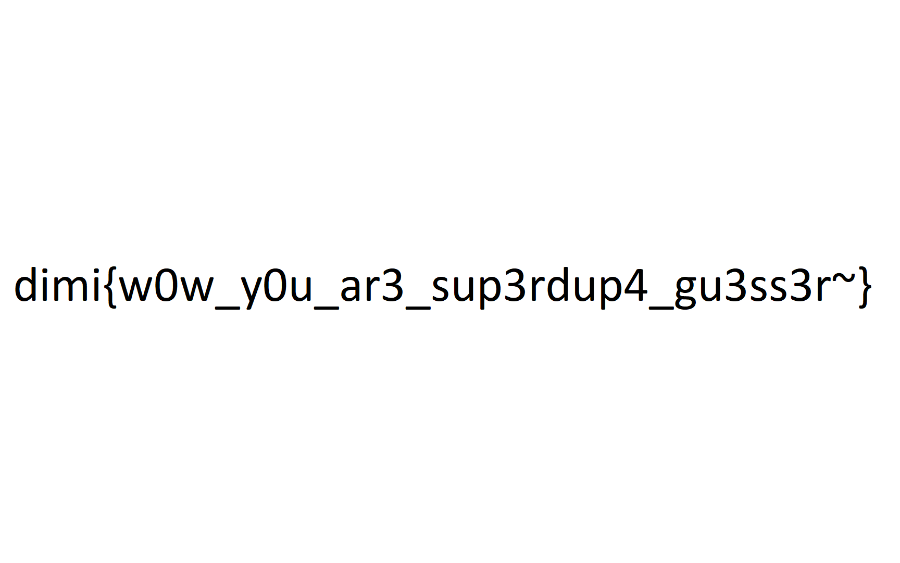

# Guess (910p)

## Overview
where is my flag.png?

just guess, not crypto, find img in online

DOWNLOAD

## Solution
정말 말그대로 Guess 문제 였다

flag.png 라는 이미지를 구글 드라이브를 통해서 던져 줬었는데 그 안에 있는 것은 이미지가 아니라 어떤 문자열로 보이는 값이었다. 8Xk4HCc  

근데 뭔가 URL Shortener 인가 싶어서 bit.ly, goo.gl 로도 해보고 하다가  
Image Free Hosting by shorten url 이라고 검색하니 imgur 이라는 서비스가 나와서  
i.imgur.com/8Xk4HCc 같이 URL을 만들어 들어갔더니 다음과 같은 이미지가 있어 auth했다  

## flag
dimi{w0w_y0u_ar3_sup3rdup4_gu3ss3r~}