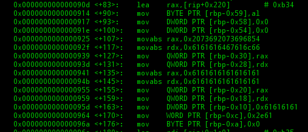
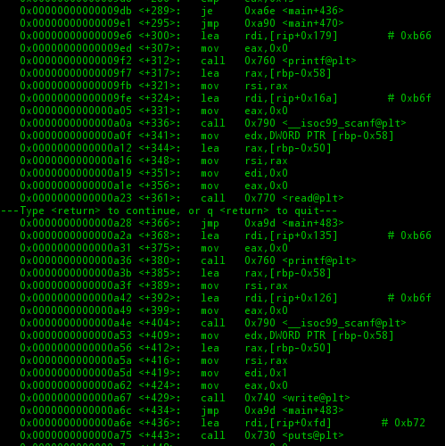
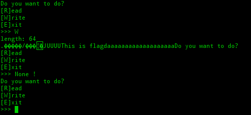
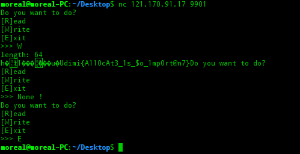

# Init (580p)

## Overview

서버 바이너리에는 정상적으로 플래그가 있습니다  
nc 121.170.91.17 9901  
DOWNLOAD

## Solution
문제에서 바이너리 하나를 던져준다  

그걸 GDB를 통해서 까보면 메모리상에 특정 문자열을 올리는 것이 보인다

보면은 스택의 rbp-0x30 에 문자열을 넣는 것이 보인다  

Read하는 fd가 0(stdin) 이고  
Write하는 fd 1(stdout) 이므로  
Read 명령은 입력을 받고 Write는 해당 위치 scanf로 입력 받은 값(rbp-0x58, 위에서 스택 할당을 해준 4byte 변수다)만큼 [rbp-50] 부터 읽어온다  
고로 우리가 읽고 싶은 저 문자열을 읽고 싶다면 64을 입력하면 되겠다! (0x50-0x10 == 64)

맞는 거 같다!! 그러면 넷캣으로 접속, 적용해보자

클리어!!

## flag
dimi{A110cAt3_1s_$o_1mp0rt@n7}