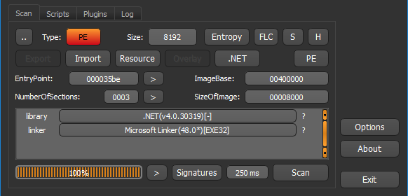

# EZPZ (500p)
뭔가 Easy Puzzle 를 축약해서 적은 거 같은 문제 이다.  

처음에는 x64dbg로 뒤적뒤적하다가 화면상에 안 떠서 다시 마음을 가라 앉히고 DIE로 파일의 유형을 검색해 보았다



.NET으로 짜여진 프로그램이라고 한다  
그리고 프로그램을 실행 시켰을 때 텍스트박스와 버튼(Go)를 가지고 있는 GUI였었고 dotPeek으로 디컴파일 하여 다음과 같은 소스를 얻을 수 있었다.  

```Csharp
// Decompiled with JetBrains decompiler
// Type: EZPZ.EZ
// Assembly: EZPZ, Version=1.0.0.0, Culture=neutral, PublicKeyToken=null
// MVID: 72952F30-719D-4DAC-A51F-C69CF8C67D72
// Assembly location: C:\Users\Moreal\Desktop\diimictf\probs\rev\EZPZ\EZPZ.exe

using System;
using System.ComponentModel;
using System.Drawing;
using System.Windows.Forms;

namespace EZPZ
{
  public class EZ : Form
  {
    private IContainer components;
    private Button button1;
    private TextBox INPUT;

    public EZ()
    {
      this.InitializeComponent();
    }

    private void Form1_Load(object sender, EventArgs e)
    {
    }

    private void button1_Click(object sender, EventArgs e)
    {
      if (string.Compare(this.INPUT.Text, "Welcome_reversing") != 0)
        return;
      int num = (int) MessageBox.Show("dimi{" + this.INPUT.Text + "}");
    }

    protected override void Dispose(bool disposing)
    {
      if (disposing && this.components != null)
        this.components.Dispose();
      base.Dispose(disposing);
    }

    private void InitializeComponent()
    {
      this.button1 = new Button();
      this.INPUT = new TextBox();
      this.SuspendLayout();
      this.button1.Location = new Point(423, 14);
      this.button1.Name = "button1";
      this.button1.Size = new Size(75, 23);
      this.button1.TabIndex = 2;
      this.button1.Text = "GO";
      this.button1.UseVisualStyleBackColor = true;
      this.button1.Click += new EventHandler(this.button1_Click);
      this.INPUT.Location = new Point(12, 12);
      this.INPUT.Name = "INPUT";
      this.INPUT.Size = new Size(363, 25);
      this.INPUT.TabIndex = 1;
      this.AutoScaleDimensions = new SizeF(8f, 15f);
      this.AutoScaleMode = AutoScaleMode.Font;
      this.ClientSize = new Size(515, 52);
      this.Controls.Add((Control) this.INPUT);
      this.Controls.Add((Control) this.button1);
      this.FormBorderStyle = FormBorderStyle.FixedDialog;
      this.MaximizeBox = false;
      this.MinimizeBox = false;
      this.Name = nameof (EZ);
      this.Opacity = 0.01;
      this.Text = nameof (EZ);
      this.Load += new EventHandler(this.Form1_Load);
      this.ResumeLayout(false);
      this.PerformLayout();
    }
  }
}

```

우리가 볼 부분은 Go 버튼을 눌렀을 때의 이벤트 였기 때문에 다음부분만 보기로 했다

```Csharp
    private void button1_Click(object sender, EventArgs e)
    {
      if (string.Compare(this.INPUT.Text, "Welcome_reversing") != 0)
        return;
      int num = (int) MessageBox.Show("dimi{" + this.INPUT.Text + "}");
    }
```

입력한 값이 Welcome_reversing 이랑 같은 면 플래그를 출력하는데 dimi{Welcome_reversing} 을 출력한다고 한다  

어라.. 플래그를 그냥 거저 줬다

## flag

dimi{Welcome_reversing}