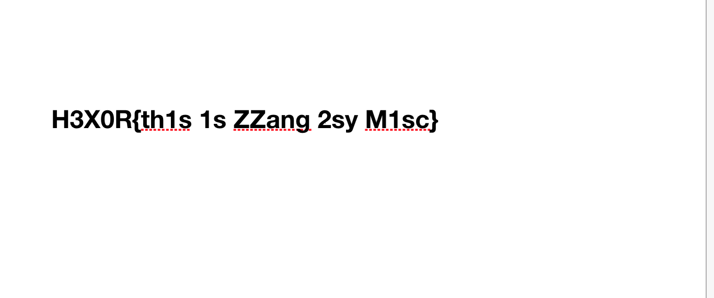

# RealrudaGaBabymisc

## Overview

author : kangsecu  
point : 280  
solvers : 22  

FLAG의 공백은 _(언더바)입니다.

Files  
[RealrudaGaBabymisc.7z](./bin/realrudagagaRealrudaGaBabymisc.7z)

## Solution
해당 압축 파일을 열면 동일한 규칙의 문자열이 보인다

```
0,0: (255,255,255,1)    
1,0: (255,255,255,1)    
2,0: (255,255,255,1)    
3,0: (255,255,255,1)    
4,0: (255,255,255,1)    
5,0: (255,255,255,1)    
6,0: (255,255,255,1)    
...
```
딱 보아하니 픽셀의 위치랑 색상이 이다

그래서 파싱하여 이미지 파일뢰 만드는 코드를 작성하여 플래그 이미지를 GET, Clear!!



## Flag

H3X0R{th1s_1s_ZZang_2sy_M1sc}